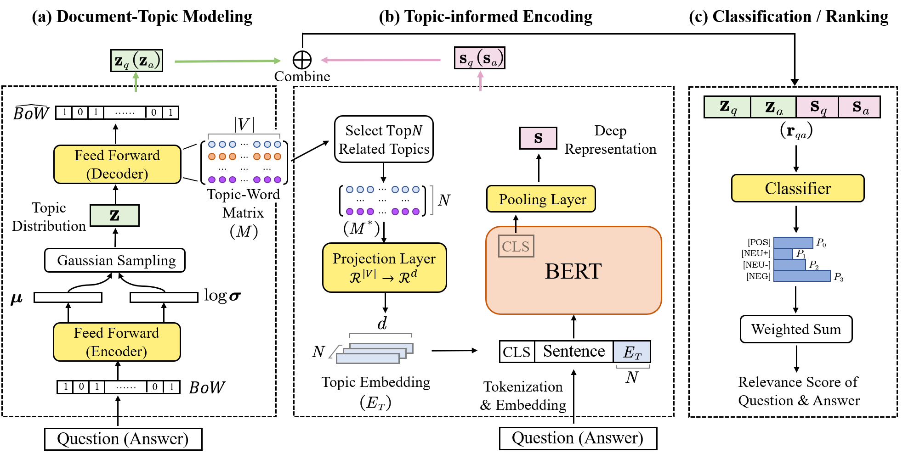

# TopicAns: Topic-Informed Architecture for Answer Recommendation on Technical Q&A Site

TopicAns aims at learning high-quality representations for the posts in Q&A sites with a neural topic model and a pre-trained model.

This involves three main steps: (1) generating topic-aware representations of Q\&A posts with the **neural topic model**, (2) incorporating the corpus-level knowledge from the neural topic model to enhance the deep representations generated by the **pre-trained language model**, and (3) determining the most suitable answer for a given query based on the topic-aware representation and the deep representation.



## Requirement

Install all required python dependencies:
``` bash
pip install -r requirements.txt
```

## Dataset Construction and Pre-process

Our datasets are released at https://drive.google.com/drive/folders/1Pf8zyJGdufi_14qeAigPI1yyOkiL881J?usp=share_link.

Following is how we get them:

1. Download `stackoverflow.com-Posts.7z` from https://archive.org/details/stackexchange

2. Run `dataset_scripts/split_qa.py` to get:
    1. q_temp_output.csv: ["Id", "PostTypeId", "Score", "AnswerCount", "AcceptedAnswerId", "Title", "Body", "Tags"]
    2. a_temp_output.csv: ["Id", "PostTypeId", "Score", "ParentId", "Body"]
    3. python_question_info

3. Run ```dataset_scripts/extract_python_qa.ipynb``` to get python_qa (This file can also be used to get java_qa pairs!). This file does:
    1. Get python_question_info: (q_id, 1, accepted_a_id, other_a_ids...)
    2. Get python_q_id_content.csv, python_a_id_content.csv
    3. Then process the above two files
    4. delete some trash questions from python_question_info, and save the new one as python_qa_info.dataset. Please read this file by `datasets` (huggingface).
   
4. Then we need to construct candidate answer pools following Gao et al. by `construct_candidate_pools.py`.

5. Finally, we combine all together and get our datasets by `combine_py_related_question.ipynb`


## Instructions

### Training

```bash
python -u main.py -d so_python -n 0 \
    --model_class QATopicMemoryModel \
    --model_save_prefix top10_topic25_pooler_ \
    --pretrained_bert_path huggingface/CodeBERTa-small-v1 \
    --composition pooler \
    --train_batch_size 16 \
    --gradient_accumulation_steps 4 \
    --text_max_len 512 \
    --latent_dim 25 \
    --two_stage \
    --no_initial_test
```

The best model is saved at `./model/` and the lastest model is saved at `./last_model/`. If training is broken, you can add `---restore` at the last without other changing. We have supported logging, so you can choose append `| tee this_is_log.log` to the command.


### Inference

```bash
python -u main.py -d so_python -n 0 \
    --model_class QATopicMemoryModel  \
    --model_save_prefix top10_topic25_pooler_ \
    --pretrained_bert_path huggingface/CodeBERTa-small-v1 \
    --composition pooler \
    --train_batch_size 16 \
    --gradient_accumulation_steps 4 \
    --text_max_len 512 \
    --latent_dim 25 \
    --two_stage \
    --no_initial_test \
    --measure_time \
    --no_train
```

## Citation

If you find this project useful in your research, please consider cite:

```
@article{
    Todo
}
```

## License

This project is licensed under the MIT License.